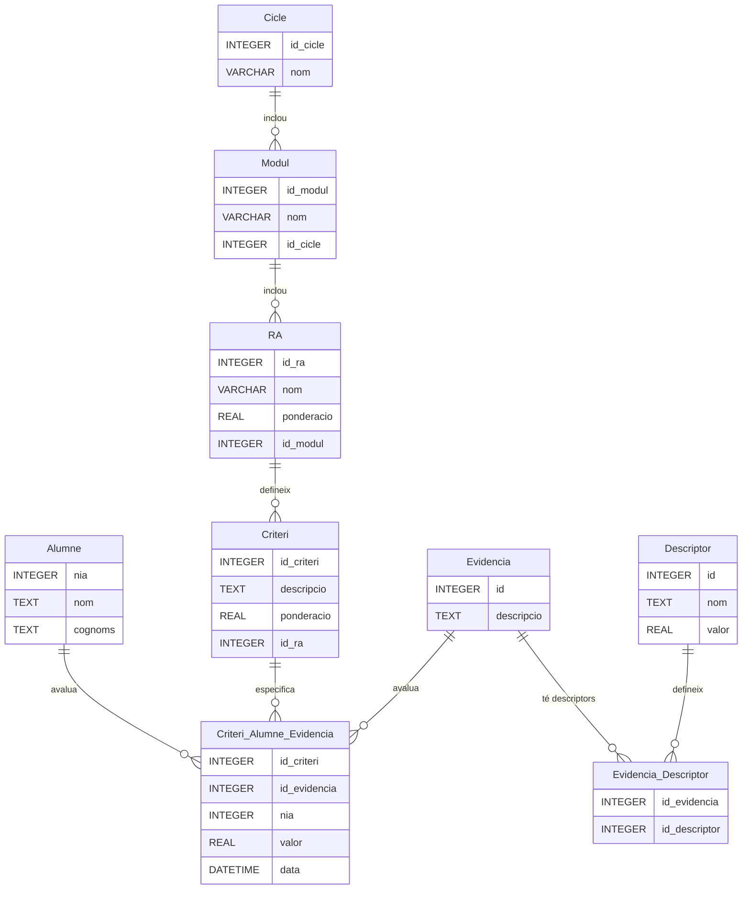

# Avaluar per competències

L'objectiu d'aquesta aplicació és facilitar l'avaluació per competències en els mòduls, evitant la necessitat de ponderar específicament els instruments d'avaluació. Aquest sistema es basa en criteris, evidències i resultats d'aprenentatge (RA) per calcular automàticament el progrés i les notes dels alumnes.

## Registre Automàtic d'Evidències per a Nous Alumnes

Quan es registra un alumne nou, el sistema crea automàticament una entrada a la taula `Criteri_Alumne_Evidencia` amb una evidència inicial, denominada **"Avaluació Zero"**, associada a tots els criteris. Aquesta funció garanteix que cada alumne comenci amb un registre base sobre el qual es podrà avaluar el seu progrés.

## Descriptors Associats a Evidències

Cada evidència té una sèrie de descriptors predefinits que es creen automàticament quan es registra l'evidència. Aquests descriptors inclouen una qualificació associada que ajuda a uniformitzar les notes i la interpretació del progrés. Alguns exemples de descriptors són:

- **Assolit**: 5
- **Excel·lent**: 10
- **Notable**: 9
- **Suficient**: 6
- **Insuficient**: 4

Els descriptors permeten una avaluació més precisa i qualitativa, afegint significat a les notes numèriques.

### Exemple d'ús dels descriptors
1. Una evidència denominada **"Projecte 1"** pot tenir els següents descriptors:
   - `Excel·lent`: 10 punts
   - `Bé`: 8 punts
   - `Suficient`: 6 punts
   - `Insuficient`: 4 punts

2. Quan un alumne rep una nota d'aquesta evidència, es pot assignar directament el valor associat al descriptor escollit, simplificant el càlcul i mantenint la coherència.

## Càlcul del Progrés i Aconseguit

### Conceptes Clau
1. **Progrés de cada RA**: El progrés d'un resultat d'aprenentatge es determina pel sumatori dels valors aconseguits dels criteris associats.
2. **Aconseguit de cada criteri**: Representa la mitjana ponderada de les notes de les evidències associades a aquest criteri.

### Fórmules
- **Càlcul de l'Aconseguit de cada criteri**:
  $
  \text{Aconseguit\_Criteri} = \left( \frac{\sum \text{Nota\_Evidencia}}{\text{Nombre\_Evidencies}} \right) \times \text{Ponderacio\_Criteri}
  $

  - `Nota_Evidencia`: Valor de cada evidència registrada segons el descriptor.
  - `Nombre_Evidencies`: Nombre total d'evidències associades al criteri.
  - `Ponderacio_Criteri`: Pes específic del criteri en el resultat d'aprenentatge.

- **Càlcul del Progrés de cada RA**:
  $
  \text{Progrés\_RA} = \sum \text{Aconseguit\_Criteri}
  $

- **Càlcul de la Nota del mòdul**:
  $
  \text{Nota\_Modul} = \sum \left( \text{Aconseguit\_RA} \times \text{Ponderacio\_RA} \right)
  $

  - `Ponderacio_RA`: Pes assignat a cada resultat d'aprenentatge dins del mòdul.

## Avantatges del Sistema
- **Automatització**: Els càlculs són automàtics, reduint l'error humà i estalviant temps al professorat.
- **Descriptors predefinits**: Els descriptors estandarditzen les notes i faciliten una interpretació coherent entre professors i alumnes.
- **Flexibilitat**: Permet avaluar els alumnes basant-se en els criteris establerts, sense necessitat de ponderar manualment cada instrument.
- **Claredat**: Les fórmules proporcionen un marc transparent per al càlcul de les notes i del progrés dels alumnes.

## Exemple d'Aplicació
1. Un alumne té associades tres evidències per a un criteri amb una ponderació del 30%. Les seves notes són:
   - Evidència 1: Descriptor **"Excel·lent"** (10 punts).
   - Evidència 2: Descriptor **"Bé"** (8 punts).
   - Evidència 3: Descriptor **"Suficient"** (6 punts).

   - Aconseguit del criteri:
     $
     \text{Aconseguit\_Criteri} = \left( \frac{10 + 8 + 6}{3} \right) \times 0.3 = 7.2
     $

2. Si el RA té tres criteris, el progrés es calcula sumant els `Aconseguit_Criteri` dels tres.

3. Finalment, la nota del mòdul es calcula integrant el progrés de tots els RA amb les seves ponderacions.

Aquest sistema facilita l'avaluació contínua i orientada a competències, assegurant que els alumnes avancen en base als resultats establerts.

- **Progrés de cada RA**: És igual al sumatori dels aconseguits dels criteris.
- **Aconseguit de cada criteri**: És igual al sumatori de les notes de les evidències que tenen nota dividit pel nombre d'aquestes, tot multiplicat per la ponderació de cada criteri.

### Fórmules

- **Aconseguit de cada criteri**:
  \[
  \text{Aconseguit\_Criteri} = \left( \frac{\sum \text{Nota\_Evidencia}}{\text{Nombre\_Evidencies}} \right) \times \text{Ponderacio\_Criteri}
  \]

- **Progrés de cada RA**:
  \[
  \text{Progrés\_RA} = \sum \text{Aconseguit\_Criteri}
  \]

- **Nota del mòdul**:
  \[
  \text{Nota\_Modul} = \sum \left( \text{Aconseguit\_RA} \times \text{Ponderacio\_RA} \right)
  \]

Aquestes fórmules ajuden a clarificar com es calculen les notes i els progressos dins del sistema.