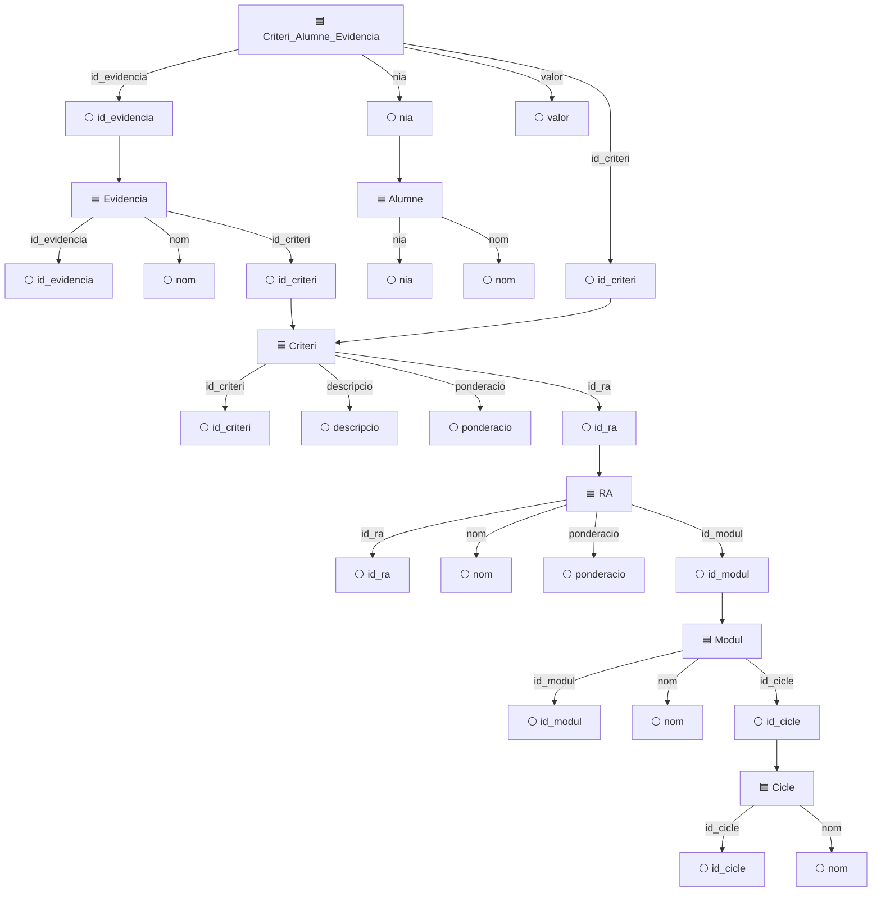

# avaluar
Aplicació per aconseguir posar notes als mòduls sense ponderar instruments 

```mermaid
flowchart TD
    %% Entitat Cicle
    Cicle["🟦 Cicle"] -->|id_cicle| CicleID["⚪ id_cicle"]
    Cicle -->|nom| CicleNom["⚪ nom"]

    %% Entitat Modul
    Modul["🟦 Modul"] -->|id_modul| ModulID["⚪ id_modul"]
    Modul -->|nom| ModulNom["⚪ nom"]
    Modul -->|id_cicle| ModulCicle["⚪ id_cicle"]
    ModulCicle --> Cicle

    %% Entitat RA
    RA["🟦 RA"] -->|id_ra| RAID["⚪ id_ra"]
    RA -->|nom| RANom["⚪ nom"]
    RA -->|ponderacio| RAPonderacio["⚪ ponderacio"]
    RA -->|id_modul| RAModul["⚪ id_modul"]
    RAModul --> Modul

    %% Entitat Criteri
    Criteri["🟦 Criteri"] -->|id_criteri| CriteriID["⚪ id_criteri"]
    Criteri -->|descripcio| CriteriDescripcio["⚪ descripcio"]
    Criteri -->|ponderacio| CriteriPonderacio["⚪ ponderacio"]
    Criteri -->|id_ra| CriteriRA["⚪ id_ra"]
    CriteriRA --> RA

    %% Entitat Evidencia
    Evidencia["🟦 Evidencia"] -->|id_evidencia| EvidenciaID["⚪ id_evidencia"]
    Evidencia -->|nom| EvidenciaNom["⚪ nom"]
    Evidencia -->|id_criteri| EvidenciaCriteri["⚪ id_criteri"]
    EvidenciaCriteri --> Criteri

    %% Entitat Alumne
    Alumne["🟦 Alumne"] -->|nia| AlumneNIA["⚪ nia"]
    Alumne -->|nom| AlumneNom["⚪ nom"]

    %% Entitat Criteri_Alumne_Evidencia
    CAE["🟦 Criteri_Alumne_Evidencia"] -->|id_criteri| CAECriteri["⚪ id_criteri"]
    CAE -->|id_evidencia| CAEEvidencia["⚪ id_evidencia"]
    CAE -->|nia| CAEAlumne["⚪ nia"]
    CAE -->|valor| CAEValor["⚪ valor"]
    CAECriteri --> Criteri
    CAEEvidencia --> Evidencia
    CAEAlumne --> Alumne
``` 
