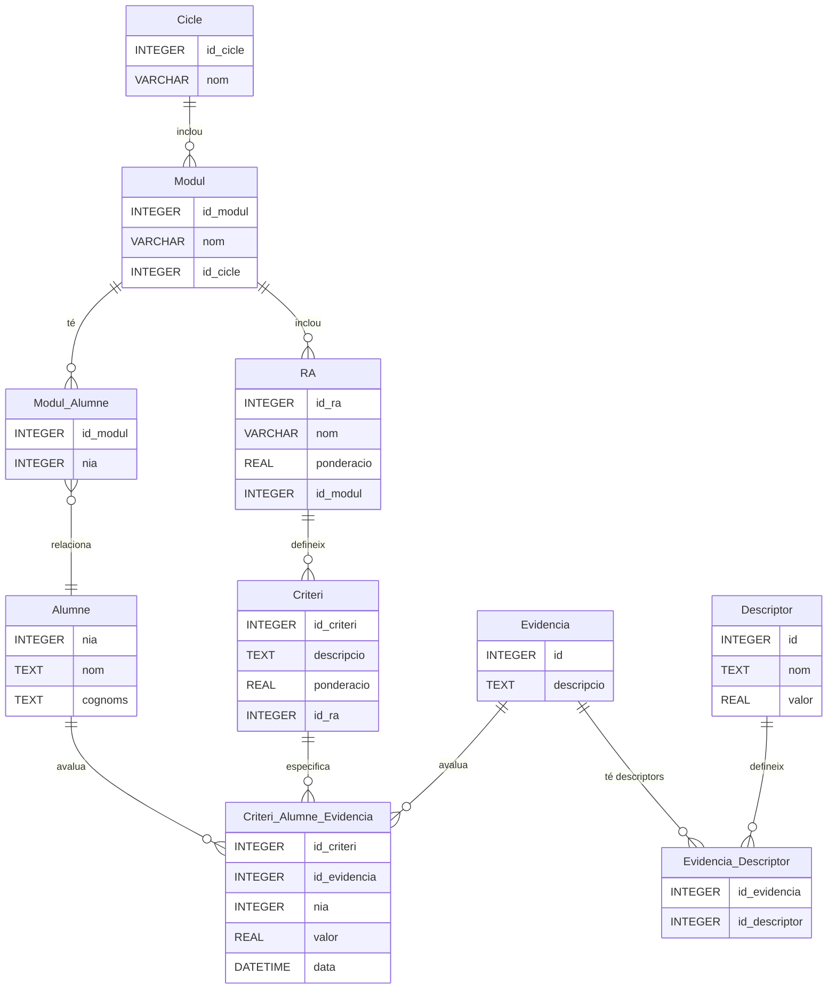

# Avaluar per competències
Aplicació per aconseguir posar notes als mòduls sense ponderar els instruments. 

## Registre automàtic d'evidències per a nous alumnes

Cada vegada que es registra un alumne nou, cal que automàticament es registre un valor a la taula `Criteri_Alumne_Evidencia` amb una evidència com "Avaluació Zero" associada a tots els criteris.

## Càlcul del Progrés i Aconseguit

- **Progrés de cada RA**: És igual al sumatori dels aconseguits dels criteris.
- **Aconseguit de cada criteri**: És igual al sumatori de les notes de les evidències que tenen nota dividit pel nombre d'aquestes, tot multiplicat per la ponderació de cada criteri.

### Fórmules

- **Aconseguit de cada criteri**:
  \[
  \text{Aconseguit\_Criteri} = \left( \frac{\sum \text{Nota\_Evidencia}}{\text{Nombre\_Evidencies}} \right) \times \text{Ponderacio\_Criteri}
  \]

- **Progrés de cada RA**:
  \[
  \text{Progrés\_RA} = \sum \text{Aconseguit\_Criteri}
  \]

- **Nota del mòdul**:
  \[
  \text{Nota\_Modul} = \sum \left( \text{Aconseguit\_RA} \times \text{Ponderacio\_RA} \right)
  \]

Aquestes fórmules ajuden a clarificar com es calculen les notes i els progressos dins del sistema.